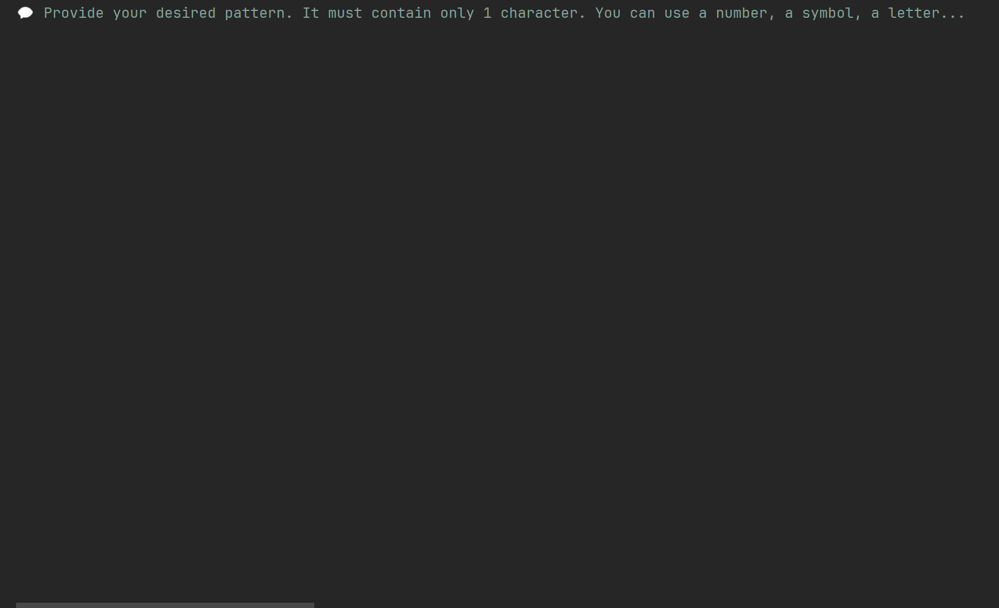

# ⭐ DAM - Exercise 2

### Objective 🎯
---
Creating a customized chess board.

### How does the app work ⚙️
---
1. Ask for a single character to use as custom decoration in the board chess cells.
2. Ask for a cell size (it has to be a positive integer number, from 1 to 15 both included).
3. Paint the chess board with the custom character and size provided by the user.

### Demo GIF 📹
---

